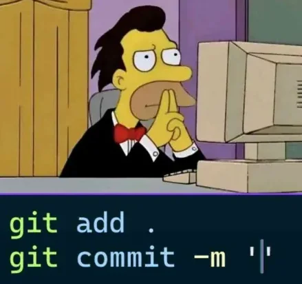

<div style="text-align:center">
  

  # MateCommit

  **Lo creé porque me daba una paja atómica pensar qué nombre ponerle a cada commit.**

  

  ¿Viste esa sensación de quedarte mirando la terminal sin saber qué escribir después de estar horas codeando? Bueno, MateCommit nació para que no pierdas más tiempo en eso. Es una CLI potenciada por IA que lee tus cambios y te sugiere mensajes de commit claros, profesionales y con sentido, para que vos te ocupes de seguir laburando y no de redactar.

  [](https://goreportcard.com/report/github.com/thomas-vilte/matecommit)
  [](https://opensource.org/licenses/MIT)
  [](https://github.com/thomas-vilte/matecommit/actions)

</div>

---

### Idiomas
*   [Documentación Oficial (Inglés)](../../README.md)

---

## Por qué existe MateCommit 🧉

Seamos honestos: escribir buenos mensajes de commit es clave, pero cuando estás a mil o ya terminaste una tarea pesada, lo último que querés es gastar energía mental en ver cómo explicar el `diff`. 

Armé MateCommit para automatizar esa parte aburrida del flujo de Git, pero haciéndolo bien:

- **Basta de "fix", "update" o "cambios"**: Uso LLMs (como Google Gemini) para que la IA entienda de verdad el contexto de tu código.
- **Convenciones sin esfuerzo**: Aplica *Conventional Commits* solo, así tu historial queda impecable sin que tengas que repasar los prefijos cada vez.
- **Integración real**: No es solo tirar un texto; se conecta con GitHub y Jira para que todo el laburo quede vinculado a tus tickets.
- **Cuidando el bolsillo**: Incluí un contador de tokens para que sepas exactamente cuánto estás gastando en cada consulta.

## ¿Qué hace por vos?

- **Sugerencias al toque**: Tirás un comando y tenés opciones de mensajes basadas en lo que realmente cambiaste.
- **PRs automáticos**: Genera resúmenes de Pull Requests estructurados, con planes de prueba y avisos de breaking changes.
- **Releases sin drama**: Maneja versiones, genera changelogs y crea los tags de Git por vos.
- **DX (Developer Experience)**: Está pensado para la terminal, con autocompletado y herramientas de diagnóstico para que nunca te deje a gamba.

---

## Arrancá ahora

### 1. Instalar
Si tenés Go en tu máquina:

```bash
go install github.com/thomas-vilte/matecommit/cmd/matecommit@latest
```

### 2. Configurar
Configurá tus credenciales y proveedores:

```bash
matecommit config init
```

### 3. Usar
Stageá tus cambios y dejá que la IA haga su magia:

```bash
git add .
matecommit suggest
```

#### Los atajos que más vas a usar
- `-n` : Cuántas sugerencias querés ver (por si estás exigente).
- `-l` : Para forzar el idioma (ej. si el repo es en inglés pero tu config está en español).
- `--issue` : Pasale el número de issue para que la sugerencia sea mucho más precisa.
- `-i` / `--interactive` : Elegís a mano qué archivos entran en el resumen, por si stageaste más de un cambio junto.
- `--no-emoji` : Para cuando el ambiente se pone serio y no querés dibujitos.

---

## Uso Avanzado

La idea es que MateCommit crezca con la comunidad. Está diseñado de forma modular:

*   **IA Flexible**: Podés cambiar de modelo de IA a medida que sumamos soporte.
*   **A tu medida**: Personalizá los templates para que los mensajes salgan como le gusta a tu equipo.

Si querés ver todos los comandos técnicos a fondo, pasate por [COMMANDS.md](./COMMANDS.md).

---

## Contribuir

Si tenés una idea para sumar un proveedor nuevo o mejorar la lógica, mandá tu PR. Fijate en las [Guías de Contribución](../../CONTRIBUTING.md) y metele para adelante.

---

## Licencia

Distribuido bajo la Licencia MIT. Consultá [LICENSE](../../LICENSE) para más info.